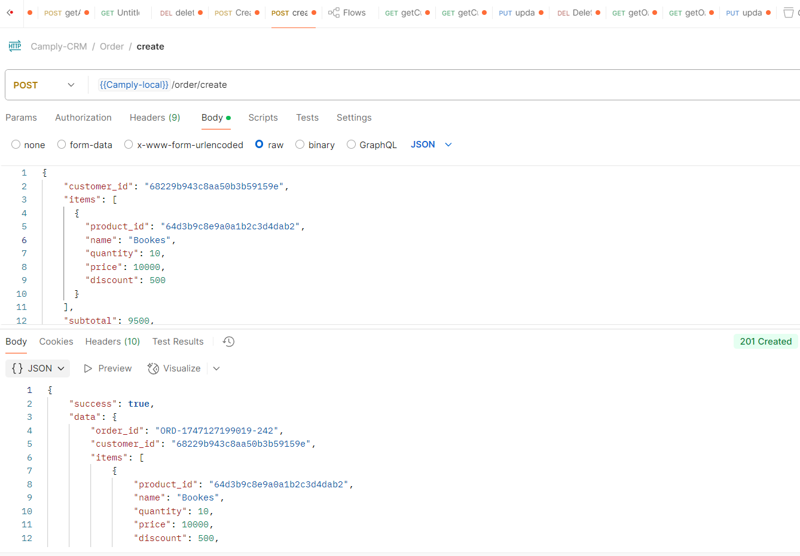
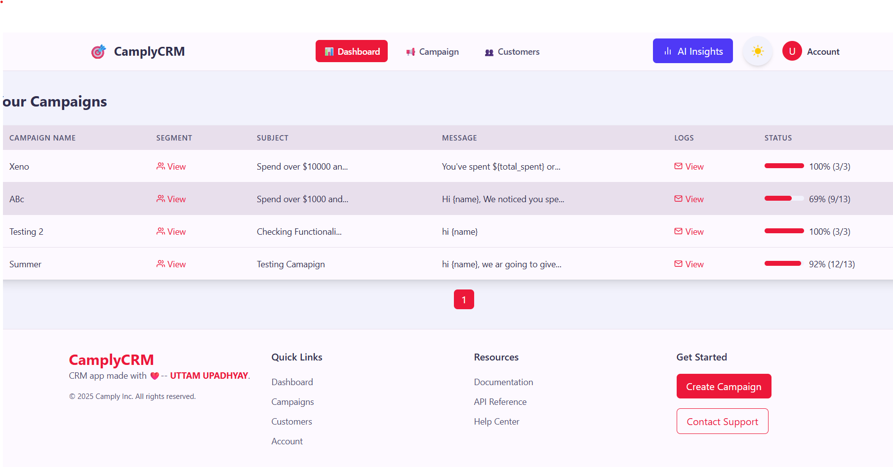

Live Demo: https://camply.netlify.app

🌟 Introduction
CAMPLY is a modern CRM platform designed for customer segmentation, personalized campaign delivery, and AI-powered insights. Built with the MERN stack, it enables businesses to create targeted campaigns, analyze performance, and automate customer engagement with AI-driven features.

🛠 Tech Stack
Frontend
React.js (Functional Components + Hooks)

Tailwind CSS (Styling with custom themes)

React Query Builder (Dynamic rule creation)

React Icons (Beautiful iconography)

Axios (API requests)

React Hot Toast (Notifications)

Google OAuth 2.0 (Authentication)

Backend
Node.js & Express.js (REST API)

MongoDB (Database)

Mongoose (ODM)

JWT (Authentication)

AI Integration
OpenAI API (AI-generated message suggestions & Smart AI Insight)

Future AI Features:

Smart Scheduling (Best time to send campaigns)

Auto-Tagging (AI labels campaigns based on intent)

Lookalike Audience Generator (AI suggests similar segments)

📂 Project Structure
Frontend Directory
📂 src/  
├── 📂 assets/ # Images, logos, etc.  
├── 📂 components/ # Reusable UI components  
│ ├── 📂 dashboard/ # Dashboard-specific components  
│ ├── 📂 forms/ # Form components  
│ └── 📂 modals/ # Modal dialogs  
├── 📂 context/ # React context providers  
├── 📂 hooks/ # Custom hooks  
├── 📂 pages/ # Main application pages  
│ ├── Dashboard.jsx # Main dashboard  
│ ├── CampaignCreate.js # Campaign creation  
│ └── Auth.jsx # Authentication  
├── 📂 utils/ # Utility functions  
└── App.js # Main app entry  
Backend Directory
📂 backend/  
├── 📂 controllers/ # API logic (customer, campaign, segment)  
├── 📂 models/ # MongoDB schemas  
├── 📂 routes/ # API endpoints  
├── 📂 middleware/ # Auth & validation  
├── 📂 services/ # Business logic (AI, async processing)  
└── server.js # Express server entry  
🎯 Key Features

1. Data Ingestion APIs ✅
   
   Secure REST APIs for customer & order data ingestion.

GUIDE PDF
You can find the complete Postman API testing guide here:  
[📥 Download Camply_API_Guide.pdf](Camply_API_Guide.pdf)

Postman documented for easy integration.

Pub/Sub Architecture (Redis Streams) for async processing (Brownie Point!).

2. Campaign Creation UI ✅
   Dynamic Rule Builder (AND/OR conditions for segmentation).

Audience Preview before campaign launch.

Beautiful Dashboard with delivery stats & history.

3. Campaign Delivery & Logging ✅
   Personalized Messaging (e.g., "Hi {name}, get 10% off!").

Simulated Vendor API (90% success rate).

Real-time Logging in communication_log.

4. Authentication ✅
   Google OAuth 2.0 (Secure login).

JWT-based sessions for protected routes.

5. AI Integration ✅
   AI-Generated Messages (Cohere-AI for personalized content), Performance Summarization (AI insights).

Smart Suggestions (Best-performing message variants).

🚀 Deployment
Frontend: Netlify (https://camply.netlify.app)

Backend: Render (Node.js + MongoDB)

CI/CD: GitHub Actions for auto-deploy

🔥 Upcoming Features (Roadmap)
AI-Powered Analytics Dashboard 📊

WhatsApp/SMS Integration 📱

Advanced Customer Behavior Tracking 🕵️‍♂️

🛠 How to Run Locally?
Clone the repo

bash
git clone https://github.com/uttam002600/Camply_Frontend
Install dependencies

bash
cd frontend && npm install
npm run dev

.env in backend (MongoDB, JWT, OpenAI keys)

.env in frontend (Google OAuth, API URL)

Run the app

bash

# Frontend

npm start

# Backend

npm run dev
📜 Postman API Docs
Run in Postman

📸 
Dashboard Campaign Creation AI Suggestions
Dashboard Campaign AI
🤝 Contributing
PRs welcome! Check out CONTRIBUTING.md.

📄 License
CRM © 2023 Uttam Upadhyay

✨ Why CAMPLY?
Smarter Campaigns with AI.

Scalable Architecture (MERN + Generative AI).

Enterprise-Ready with OAuth & RBAC.

🚀 Ready to boost your CRM? Try CAMPLY today!
